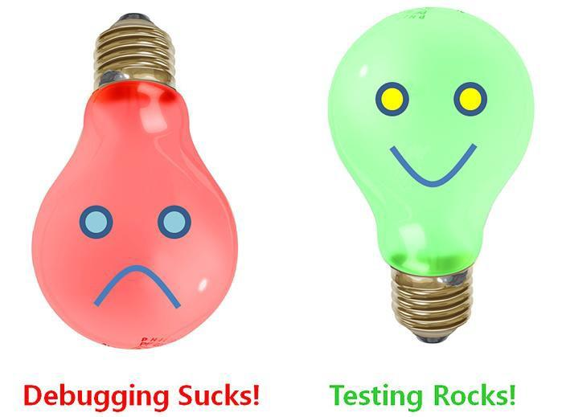

CAB302 Software Development
===========================

# Practical 6: Test Driven Development

This week's practical exercises will give you an opportunity to try Test-Driven Development in a Java/Eclipse/JUnit
programming environment.

## Exercise 1: A list of movie ratings

In this exercise you will use Test-Driven Development to produce a class called `MovieList` for maintaining a list of
movie ratings. To get you started, the file `Movie-ListTest.java` contains some JUnit tests, which are commented out.
You should *uncomment these tests one at a time*, and follow the 'red-green-refactor' process to get each test to pass.

Overall, the tests are intended to drive you towards developing a class which maintains a list of movie titles, each of
which has an associated *rating*. Ratings are assumed to be on a scale of one to five 'stars', e.g. '***'.

Although you could easily write such a class based merely on this description, the purpose of the exercise is to follow
the Test-Driven Development strategy strictly, to get a feel for the 'rhythm' it introduces to software development.

Therefore, for each test, only write and refactor enough code to pass that particular hurdle. Don't anticipate the code
needed for later tests. Also, make use of Eclipse's tooltips and 'quick fixes' to help you develop the code. Eclipse
will automatically insert templates for missing classes, methods, etc., thus saving a lot of typing.

Also provided is a simple exception class, MovieListException.java, to support
tests that may throw exceptions.

## Exercise 2: Stars versus Thumbs

The given set of tests assumed that ratings associated with movies are expressed as a number of stars. However, many
film critics use a different scale for film ratings, ranging from 'two thumbs up' to 'two thumbs down'.

In this exercise  you should add a test, or tests, that allow the ratings associated with movies to be expressed as
either a number of 'thumbs', ranging from -2 to +2, or a number of stars, ranging from 1 to 5. Note that if a movie has
been rated using stars your `getRating` method should return a string like '****', as before, but if it has been rated
using a number of thumbs it should return a string like '`One thumb up`' or '`Two thumbs down`' instead. You will then
need to modify your program to pass the new test(s), again following the red-green-refactor strategy.

**Hint:** The fact that the rating given to movies can be expressed either as a number of 'stars' or a number of 'thumbs'
suggests that these two scoring systems should be subtypes of a common 'rating' supertype.

**Note:** This exercise will require you to (slightly) rewrite some of your existing tests, to distinguish numerical
scores in 'stars' from those in 'thumbs'. Remember that maintaining the tests is just as important as developing the
program code!

## Exercise 3: Academy Award Winners

In this exercise you will introduce a *mock* object to represent an external data source.
The annual Academy Awards, or 'Oscars', have a big impact on a movie's fortunes. One of the given tests,
`listAlphabetically`, required the `MovieList` class to produce an alphabetically-sorted list of movie titles,
suitable for printing. In this exercise we want to distinguish those movies that have won Academy Awards, by preceding
their names in the list with string '`Oscar winner: `'.

Firstly, therefore, you should modify test `listAlphabetically` so that Academy Award winners' names are preceded by
string '`Oscar winner: `'. (Note: Of the films mentioned in the provided unit tests, *Casablanca*, *Citizen Kane* and
*Star Wars* all won Oscars.)

Next you need to introduce a mock (or 'stub') database that tells you whether or not a movie has won an Academy Award,
given its title. Only enough entries need to be included to make the tests pass. You can then use the mock database to
make your revised `listAlphabetically` method pass the changed test.

**Observation:** The code you add to your program to interface with the mock database is incomplete. It must eventually
be replaced by 'real' code to access a 'real' database of Oscar winners, and should be clearly commented as such, e.g.
with an Eclipse '`TODO`' comment.

And remember, as the programmers at Google say, ...

